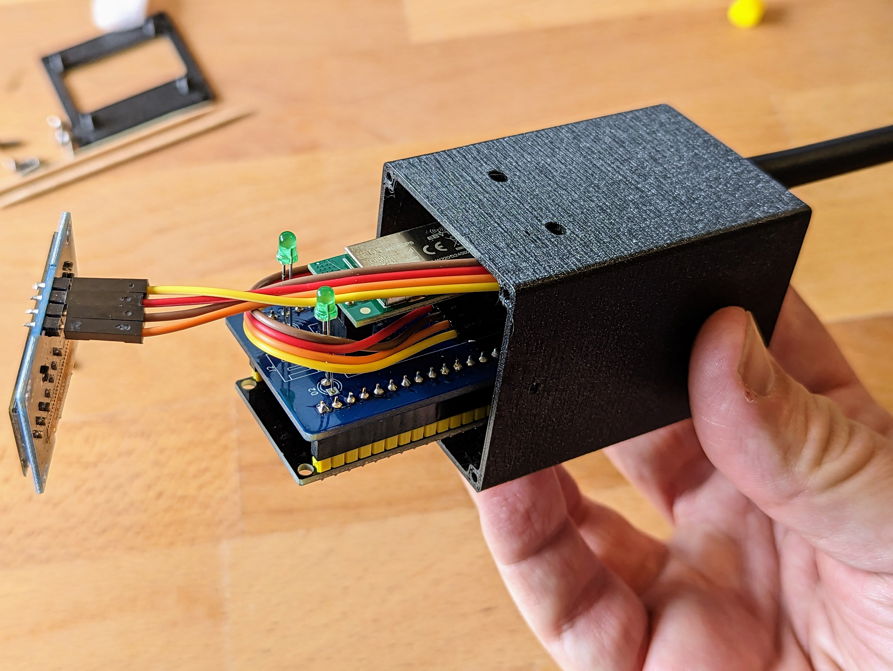
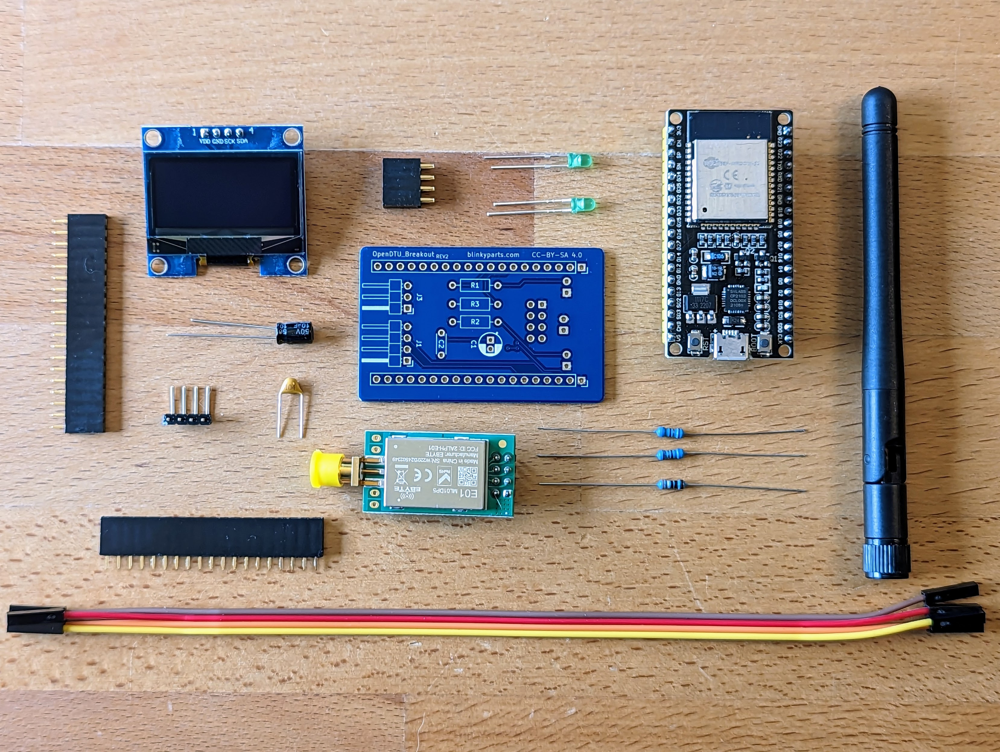

# OpenDTU Breakout Board

This is a fully comaptible Breakout Board for the [OpenDTU](https://github.com/tbnobody/OpenDTU/) Project. With the opendtu breakout board and the opendtu software, you can read out, control and process Hoymiles inverters. In addition, the current energy yield is shown directly on a display.

This PCB has been designed together with the developers and is fully compatible. New features will of course always be added immediately ;).

### Parts List

| Quantity | Name | Description | Label/Color Code |
|----------|------|-------------|------------------|
| 1     | U1   | ESP32       | ESP32-WROOM32         |
| 1     | U2   | Wireless module   | ML01DP5               |
| 2     | D1,D2 | 3mm green LED |                      |
| 1     | C1   | 10µF capacitor |                      |
| 2     | C2   | 100nF ceramic capacitor | 104                |
| 1     | J1   | 4x L-shaped pin header |                      |
| 2     | U1   | 1x19 pin female header |                      |
| 1     |      | 4-way cable |                      |
| 1     | R1,R2 | 68Ω resistor |  |
| 1     | R3   | 390Ω resistor |  |
| 1     |      | PCB (Printed Circuit Board) |                      |
| 6     |      | Optional: M2x6 screw |                      |
| 2     |      | Optional: 3D-printed case parts |                      |
| 2     |      | Not included: Toothpick |                      |
| 1     |      | Not included: Micro-USB cable |                      |

### Purchase a Soldering Kit

If you don't want to source the PCBs and components yourself, you can also buy a soldering kit directly from the online shop at blinkyparts.com: [https://shop.blinkyparts.com/de/OpenDTU-Breakoutboard-Dein-Auswertung-fuer-deine-Balkonsolaranlage/blink237542](https://shop.blinkyparts.com/de/OpenDTU-Breakoutboard-Dein-Auswertung-fuer-deine-Balkonsolaranlage/blink237542)

### Manual
You can find the manual and pictures of every build step here: [https://github.com/Binary-Kitchen/SolderingTutorial/tree/master/OpenDTU_Breakout](https://github.com/Binary-Kitchen/SolderingTutorial/tree/master/OpenDTU_Breakout)

### Copyright and Authorship

- Board: [CC-BY-NC-SA 4.0](https://creativecommons.org/licenses/by-nc-sa/4.0/) - Noby, Jan and Timo @ [blinkyparts.com](https://shop.blinkyparts.com)
- Code: [GPLv2](https://www.gnu.org/licenses/old-licenses/gpl-2.0.html) - [tbnobody](https://github.com/tbnobody/OpenDTU)
- Manual (TeX): [LPPL](https://www.latex-project.org/lppl.txt) - [Marei Peischl](https://peitex.de)
- Manual (pdf): [CC-BY-SA 4.0](https://creativecommons.org/licenses/by-sa/4.0/) - [Binary Kitchen e.V.](https://www.binary-kitchen.de)
